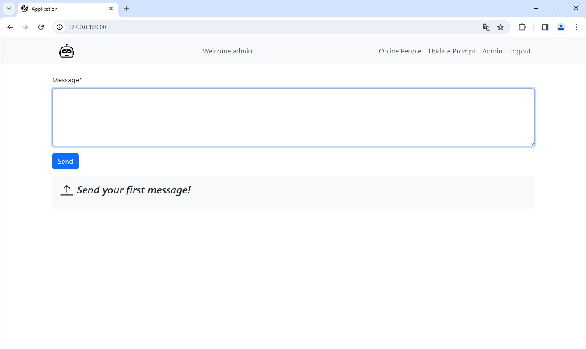

# Gemini with Prompt!

Create your own chat environment and define a prompt! People can register on this site and chat with Gemini, influenced of course by the prompt you define!
Be careful about that this project use multi-turn chat system. Therefore, make sure last message from '🤖🤖 Bot'! (If not, you can delete your last message.)

## Features

- Login/Logout/Register
- Staff members can add/modify prompts. (Superusers can talk to bot without affecting by prompt.)
- To be able to delete one message or clear entire chat history
- Markdowned special text, codes etc.

## Usage

Create a virtual environment

    python -m venv /path/to/new/virtual/environment

Activate virtual environment  
MacOS:

    source venv/bin/activate

for Windows PowerShell

    <venv_path>\Scripts\Activate.ps1  

Install dependencies 

    pip install -r requirements.txt

Migrate database  

    python manage.py makemigrations
    python manage.py migrate

Create admin user

    python manage.py createsuperuser

Start server

    python manage.py runserver

You are going to see _Update Prompt_ on navbar, when you login as a staff member. Add/update it and start chatting with Gemini. (If username is "admin", you can talk to Gemini without affecting by prompt.) Share with people to get them to talk to Gemini with your prompt.

## Images

